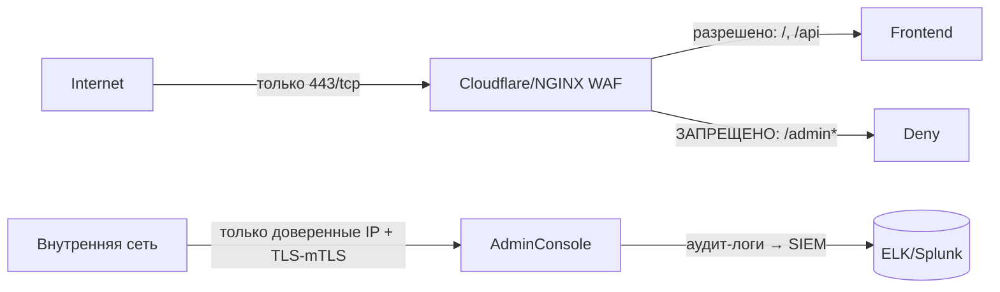

# Оценка рисков ИБ при публичной доступности админ-консоли

# Задание:
- [ ]  1. Провести анализ на возможность взлома, утечки, доступности информации и ее категории значимости для компании
- [ ]  2. Необходимо подойти к анализу в соответствии с Compliance: данные размещены на инфраструктуре в Евросоюзе, но они включают ПДн, в том числе граждан России, Евросоюза, а также в отношении информации ограниченного доступа, инсайдерской информации и иное
- [ ]  Описать риски, которые возникают из кейса, меры снижения рисков, описать уровень эффективности мер
- [ ]  Предложить техническое решение для снижения рисков ИБ
- [ ]  Привести свое заключение рисков к мерам и их эффективности.
- [ ]  Требуется проанализировать и дать пояснения на следующий перечень вопросов:
    - [ ]  Как вы опишите данную ситуацию в части обнаруженных вами недостатков архитектуры приложения, присущих ей рисков (в том числе какие риски вы видите для компании)?
    - [ ]  Какие меры по митигации рисков вы предложите в минимально необходимой и достаточной форме?

# **Выполнение задания:**
 
> **Контекст**: Компания — резидент ЕС, обрабатывает персональные данные (ПДн) граждан ЕС и РФ, работает с коммерческой и инсайдерской информацией.  
> **Обнаруженная уязвимость**: Административная консоль веб-сайта экспонируется в публичный интернет без аутентификации/авторизации.

---
## 1. Анализ ситуации: описание недостатков и рисков

###  Ключевые архитектурные недостатки
| №   | Проблема                                             | Комментарий                                                                                                                                               |
| --- | ---------------------------------------------------- | --------------------------------------------------------------------------------------------------------------------------------------------------------- |
| 1   | **Отсутствие периметра доступа**                     | Админ-консоль размещена в DMZ (публичной зоне) без контроля доступа: нет авторизации, 2FA, IP-фильтрации.                                                 |
| 2   | **Избыточная экспозиция данных**                     | Логи и формы заявок содержат ПДн (ФИО, email, телефон, должность, IP), а также коммерческие условия (цены, объёмы, скидки, контрагенты).                  |
| 3   | **Отсутствие мониторинга и алертинга**               | Нет систем обнаружения аномального доступа (например, множественные GET-запросы к `/admin/logs`).                                                         |
| 4   | **Нарушение принципа минимальных привилегий (PoLP)** | Весь функционал доступен «на чтение» любому, кто знает URL. Возможна дальнейшая эскалация (например, через XSS/CSRF — если интерфейс уязвим к инъекциям). |

---

### Категоризация рисков (по ISO/IEC 27005 + GDPR)

| Уровень | Риск | Основания | Последствия |
|---------|------|-----------|-------------|
| **Критический** | **Утечка персональных данных (ПДн)** | Нарушение ст. 5, 32 GDPR: отсутствие технических мер (шифрование, контроль доступа). ПДн граждан ЕС и РФ → нарушение [ФЗ-152](https://www.consultant.ru/document/cons_doc_LAW_61801/) и GDPR. | Штрафы до **4% глобального оборота** или **€20 млн** (GDPR), репутационные потери, иски от субъектов данных. |
| **Критический** | **Утечка коммерческой/инсайдерской информации** | Данные о ценах, скидках, объёмах поставок = **секреты производства** (ст. 139 ГК РФ), **insider information** (MAR/EU 596/2014). | Потеря конкурентных преимуществ, судебные иски от клиентов/партнёров, нарушение NDA. |
| **Высокий** | **Компрометация учётных записей администраторов** | Логи содержат IP-адреса админов → возможность геолокации, корреляции с другими утечками, таргетированных атак (например, spear-phishing + IP-spoofing). | Повышение риска APT-атак, компрометации внутренней инфраструктуры. |
| **Средний** | **Подделка или подмена данных** | Если интерфейс позволяет не только *чтение*, но и *редактирование* (даже без явной формы — через API), возможна модификация заявок/логов. | Юридические риски (фальсификация коммерческих предложений), искажение отчётности. |

---

## 2. Меры снижения рисков 

### Принцип: *Defense in Depth* + *Privacy by Design* (GDPR Art. 25)

| Риск                              | Мера                                                                                                                                                                                                                     |
| --------------------------------- | ------------------------------------------------------------------------------------------------------------------------------------------------------------------------------------------------------------------------ |
| **ПДн / Коммерческая информация** | **1. Экстренное отключение публичного доступа**<br>— Перенести `/admin` в изолированную сеть (VLAN / приватный subnet)<br>— Заблокировать внешний доступ через WAF/NGFW (например: `deny all to /admin* from 0.0.0.0/0`) |
|                                   | **2. Внедрение MFA + RBAC**<br>— Требовать 2FA (TOTP/WebAuthn) для входа в админку<br>— Делегировать права: «только просмотр заявок» ≠ «редактирование цен»                                                              |
|                                   | **3. Анонимизация/псевдонимизация ПДн в логах**<br>— Маскировать email, телефон: `user***@domain.com`, `+7***-**-**-55`<br>— Удалять IP-адреса после 24ч (если не требуется для безопасности)                            |
| **Мониторинг**                    | **4. Внедрение SIEM + алертинг**<br>— Интеграция логов админки в ELK/Splunk<br>— Алерт при запросе `/admin/*` с незнакомого IP/страны                                                                                    |
| **Compliance**                    | **5. Аудит и DPO-уведомление**<br>— Провести внутренний аудит: какие ещё интерфейсы «утекают»?<br>— Уведомить DPO (Data Protection Officer) → оценка необходимости уведомления регулятора                                |

> **Эффективность мер оценивается как «высокая»**, так как устраняют корневую причину (публичный доступ) и снижают последствия при частичных компрометациях.

---

##  3. Техническое решение 

1. **NGINX-конфиг (пример блокировки)**:
```bash
location ^~ /admin {
    allow 192.168.10.0/24;   # внутренняя сеть
    allow 203.0.113.5;       # IP офиса
    deny all;
    auth_basic "Admin Area";
    auth_basic_user_file /etc/nginx/.htpasswd;
    # Доп: require valid_user + 2FA header (например, от Keycloak)
}
```

### Архитектурные изменения:


| Риск                      | Предложенная мера                            | Бизнес-ценность                                                    | Приоритет |
| ------------------------- | -------------------------------------------- | ------------------------------------------------------------------ | --------- |
| Утечка ПДн → штрафы GDPR  | Отключение публичного доступа + анонимизация | Избежание штрафов до €20 млн, сохранение репутации                 | СРОЧНО    |
| Утечка коммерческой тайны | RBAC + MFA + внутренняя изоляция             | Сохранение конкурентных преимуществ, защита от corporate espionage | Высокий   |
| Компрометация админов     | SIEM + алертинг                              | Раннее выявление APT, снижение MTTR                                | Высокий   |
| Несоответствие compliance | Аудит + уведомление DPO                      | Избежание санкций за нарушение процедур уведомления                | СРОЧНО    |
**Итог**: Риск оценивается как **критический**, требующий немедленного вмешательства.